

  
  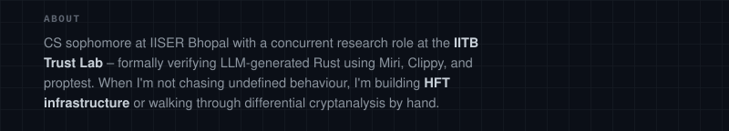
  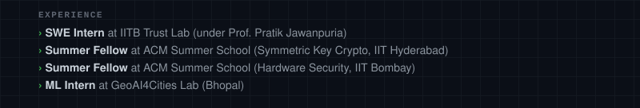
  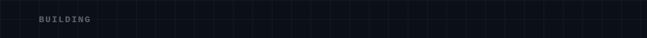
  <a href="https://github.com/scorzion/NanoMatch">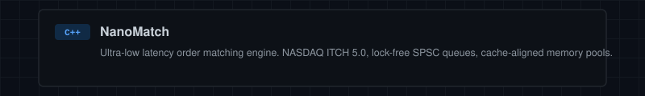</a>
  <a href="https://github.com/scorzion/titan-kv">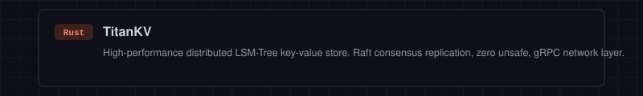</a>
  <a href="https://github.com/scorzion/Formal-Verification-Pipeline">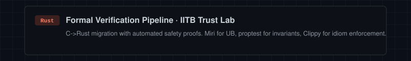</a>
  <a href="https://github.com/scorzion/Crypto">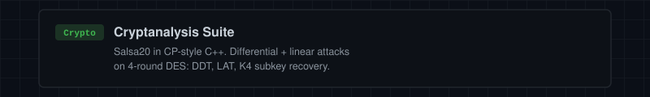</a>
  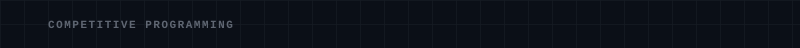

&nbsp;&nbsp;&nbsp;&nbsp;&nbsp;&nbsp;&nbsp;&nbsp;&nbsp;&nbsp;&nbsp;&nbsp;
&nbsp;&nbsp;
&nbsp;&nbsp;
&nbsp;&nbsp;

  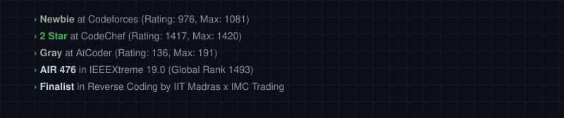
  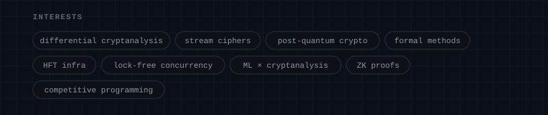
  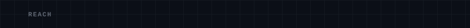

&nbsp;&nbsp;&nbsp;&nbsp;&nbsp;&nbsp;&nbsp;&nbsp;&nbsp;&nbsp;&nbsp;&nbsp;
&nbsp;&nbsp;
&nbsp;&nbsp;

  

  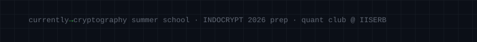

